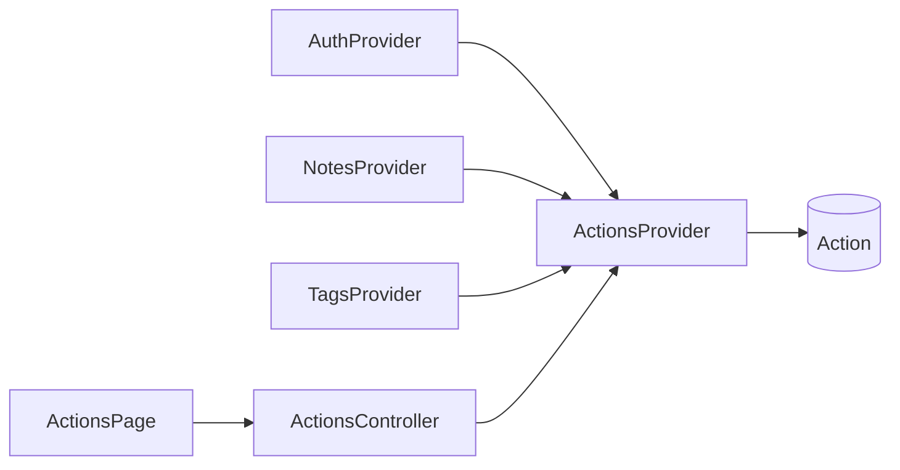

# Actions — аудит и история

## Цели

1. Аудит сессий: `login` / `login_failed` / `logout`.
2. История изменений note / tag (user на этом шаге = session-события).
3. Отдельный ресурс чтения: список + один action (без вложенных `/notes/:id/actions`).

## Решения

- Пишем только существующие `ActionType`; CRUD реквизитов и attach/detach тегов на реквизите → `update_note` с `noteId`.
- `payload` минимальный (без паролей): auth `{ email }`; note-ops `{ op, requisiteId?, tagIds? }`; tag `{ name? }` / дельта.
- `userId`: всегда для успешных операций; для `login_failed` — id если пользователь найден, иначе `null`.
- Чтение: только свои actions (`userId === session`), `deletedAt: null`.
- Enum / схема без расширения типов (миграция не нужна, если схема уже применена).

## 1. Backend — модуль `actions`

Scaffold на host: `npx nest g module|controller|provider actions --no-spec`.

[`apps/backend/src/actions/actions.provider.ts`](apps/backend/src/actions/actions.provider.ts):

- `record({ type, userId?, noteId?, tagId?, payload? })` — `prisma.action.create`; ошибки записи не должны ронять основную операцию (log + swallow / try-catch), кроме случая когда вызов внутри уже упавшей auth — там запись `login_failed` до throw.
- `listActions(userId, query?)` — `orderBy: createdAt desc`; опционально `noteId` / `tagId` / `type` (удобно для истории сущности без вложенного ресурса).
- `getAction(userId, id)` — 404 если чужой или нет.

[`apps/backend/src/actions/actions.controller.ts`](apps/backend/src/actions/actions.controller.ts):

- `GET /actions` + `GET /actions/:id`, `@UseGuards(AuthGuard)`, явные return types.
- Query DTO (zod) рядом: `noteId?`, `tagId?`, `type?` из enum.

Зарегистрировать в [`app.module.ts`](apps/backend/src/app.module.ts). Экспорт `ActionsProvider` для других модулей **или** импорт `ActionsModule` в Auth/Notes/Tags.

## 2. Точки записи

| Место                                                                             | type                                       | поля                                |
| --------------------------------------------------------------------------------- | ------------------------------------------ | ----------------------------------- |
| [`auth.provider.ts`](apps/backend/src/auth/auth.provider.ts) success login        | `login`                                    | userId, payload `{ email }`         |
| auth fail (нет user / bad password)                                               | `login_failed`                             | userId?, payload `{ email }`        |
| logout (если сессия была)                                                         | `logout`                                   | userId                              |
| [`notes.provider.ts`](apps/backend/src/notes/notes.provider.ts) createNote        | `create_note`                              | userId, noteId                      |
| deleteNote                                                                        | `delete_note`                              | userId, noteId                      |
| create/update/delete requisite, add/remove requisite tags                         | `update_note`                              | userId, noteId, payload `{ op, … }` |
| [`tags.provider.ts`](apps/backend/src/tags/tags.provider.ts) create/update/delete | `create_tag` / `update_tag` / `delete_tag` | userId, tagId, payload              |

Typed payload: добавить в [`apps/prisma/types/prisma-json.ts`](apps/prisma/types/prisma-json.ts) `ActionPayload` + `/// [ActionPayload]` на `Action.payload` (опционально в этой же итерации; zod на write — источник правды).

## 3. Frontend

- [`apps/frontend/src/api/actionsApi.ts`](apps/frontend/src/api/actionsApi.ts) — `fetchActions(params?)`, `fetchAction(id)` через `apiClient` + `Awaited<ReturnType<ActionsController[…]>>`.
- Маршрут `routes/~actions/~index.*`: лента (type, createdAt, noteId/tagId, краткий payload); клик/раскрытие одной записи через `GET /actions/:id` или данные списка.
- `AuthGuard`; ссылка Actions в [`~__root.tsx`](apps/frontend/src/routes/~__root.tsx).
- DaisyUI, без новой дизайн-системы.

## 4. Вне скоупа

- Вложенные `/notes/:id/actions`, роли/чужие ленты, hard delete actions, UI истории внутри документа заметки, отдельные `ActionType` для requisite.
