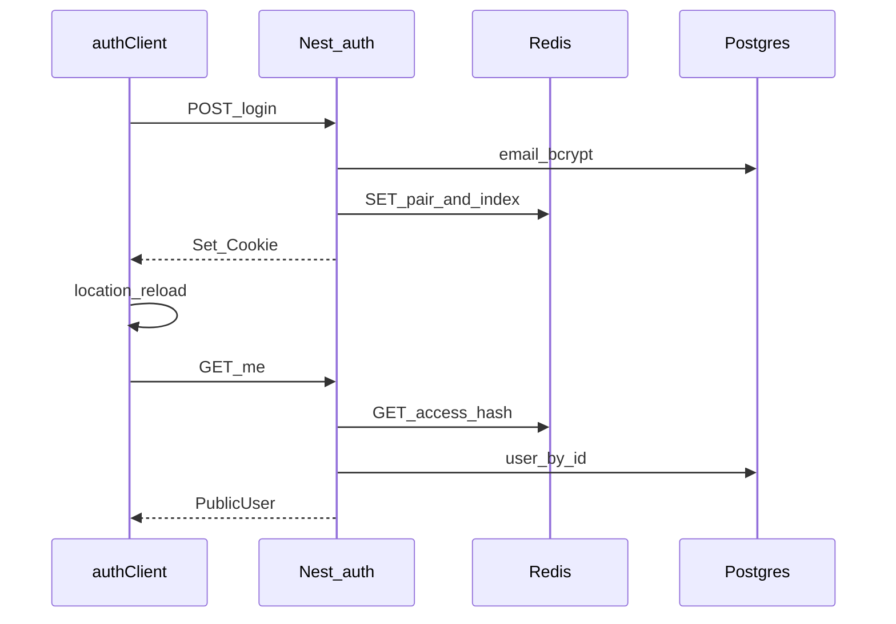

# Auth: cookies + Redis + frontend test

## Цель итерации

Рабочий цикл: войти на `/auth-test` → cookies → `/api/auth/me` отдаёт пользователя → выйти → cookies и Redis-пара очищены. Refresh-endpoint на backend готов; auto-refresh на frontend **не** делаем (см. [`.dev/http-client-manager.md`](.dev/http-client-manager.md)).

## Зафиксированные решения (диалог)

| Тема          | Решение                                                         |
| ------------- | --------------------------------------------------------------- |
| Сессии        | Без лимита на пользователя                                      |
| Logout        | Только текущая пара access+refresh                              |
| Redis layout  | Два ключа + `sessionId` в value + индекс `user:{id}:sessions`   |
| Redis client  | `ioredis` + свой Nest module/provider                           |
| Compose Redis | `requirepass` + порт на хост                                    |
| Hash токенов  | SHA-256 (без HMAC-секрета)                                      |
| TTL           | access 5 мин, refresh 7 дней                                    |
| Refresh API   | `POST /api/auth/refresh`                                        |
| Cookies       | httpOnly, Secure, SameSite=Lax, Domain из env                   |
| Cookie Domain | `.env` → `dev.yml` → backend (`COOKIE_DOMAIN`)                  |
| Zod           | Только backend; frontend dep убрать; импорт через `__backend/*` |
| DTO path      | `apps/backend/src/auth/dto.ts` рядом с controller               |
| Seed          | `root@local`, `admin@local`, `user@local` / `123`               |
| `GET /users`  | Без AuthGuard                                                   |
| apiClient     | Не трогаем (без credentials / refresh)                          |
| Session HTTP  | Отдельный `authClient` с credentials                            |
| Тест UI       | `/auth-test`                                                    |
| Пароли        | bcrypt cost 10                                                  |



---

## 1. Infra / env (детально)

### [`infra/compose/dev.yml`](infra/compose/dev.yml)

Новый сервис `redis`:

- image: `redis:7-alpine`
- command: `redis-server --requirepass ${REDIS_PASSWORD}`
- ports: `${REDIS_PORT:-6379}:6379`
- volumes: `redis_data:/data`
- healthcheck: `redis-cli -a $$REDIS_PASSWORD ping` (или эквивалент через env)
- networks: `afn`
- `depends_on` у `backend`: `redis` healthy

В `backend.environment` добавить:

- `REDIS_HOST=redis`
- `REDIS_PORT=6379` (внутренний)
- `REDIS_PASSWORD=${REDIS_PASSWORD}`
- `COOKIE_DOMAIN=${COOKIE_DOMAIN}`

### [`.env.example`](.env.example) (+ локальный `.env` у разработчика, не в git)

```
REDIS_PASSWORD=afn
REDIS_PORT=6379
COOKIE_DOMAIN=afn.localhost
```

Имена cookies и Path **не** в env (захардкодить в backend config-константах).

### Константы backend (например `auth/auth.constants.ts`)

- `ACCESS_TTL_SEC = 5 * 60`
- `REFRESH_TTL_SEC = 7 * 24 * 60 * 60`
- `TOKEN_LENGTH = 40`
- cookie names: `access_token`, `refresh_token`
- Path: access → `/api`, refresh → `/api/auth/refresh`
- SameSite: `lax`, Secure: `true`, httpOnly: `true`
- Domain: `process.env.COOKIE_DOMAIN` (обязателен в dev; пустой → ошибка старта или явный throw)

---

## 2. Prisma (детально)

### Схема [`apps/prisma/schema/user.prisma`](apps/prisma/schema/user.prisma)

```prisma
model User {
  id           String   @id @default(cuid())
  email        String   @unique
  passwordHash String
  createdAt    DateTime @default(now())
  updatedAt    DateTime @updatedAt
}
```

### Omit `passwordHash`

В [`PrismaService`](apps/backend/src/prisma/prisma.service.ts) в `super({ adapter, omit: { user: { passwordHash: true } } })` — чтобы даже случайный `findMany()` без select не отдавал хеш.

Seeders, которые **пишут** `passwordHash`, используют путь без omit или `$extends` / отдельный client для seed (seed уже в `apps/prisma` через свой PrismaClient — там omit не обязателен, seed пишет хеш явно).

### Публичный тип

[`PublicUser`](apps/prisma/types/public-user.ts) остаётся `Omit<User, 'passwordHash'>` (поле `email` вместо `login`).

### Seed

- [`data.json`](apps/prisma/seeders/users/data.json): `email` вместо `login`
- seeder: upsert по `email`, bcrypt 10

### Миграция (порядок на машине разработчика)

1. Stack up (`./scripts/dev-up.sh`) — после появления Redis в compose
2. `./scripts/prisma-migration rename_user_login_to_email` (или похожее имя)
3. `./scripts/prisma-seed` — деструктивный reset + seed (как просили: предварительно очистить БД)

Обновить [`users.provider`](apps/backend/src/users/users.provider.ts): `orderBy: { email: 'asc' }` вместо `login`.

---

## 3. Redis: модель ключей

Токен в cookie — plaintext 40 символов. В Redis ключ = префикс + `sha256(token)` (hex).

**Access key** `auth:access:{accessHash}`

```json
{
  "sessionId": "...",
  "userId": "...",
  "refreshHash": "..."
}
```

TTL = 5 минут.

**Refresh key** `auth:refresh:{refreshHash}`

```json
{
  "sessionId": "...",
  "userId": "...",
  "accessHash": "..."
}
```

TTL = 7 дней.

**Индекс сессий** `auth:user:{userId}:sessions` — Redis SET членов `sessionId`.

Дополнительно для удаления пары по `sessionId` без SCAN по всем ключам:

**Session meta** `auth:session:{sessionId}`

```json
{
  "userId": "...",
  "accessHash": "...",
  "refreshHash": "..."
}
```

TTL = как у refresh (7 дней). При ротации обновлять hashes в meta; при logout — DEL access, refresh, session meta + `SREM` из индекса.

Пользователя в Redis **не** кэшируем — только `userId` (п.25 suggestion).

Генерация токена: `crypto.randomBytes` → кодирование в алфавит длины 40 (например base64url без padding, обрезать/набрать ровно 40; или `A-Za-z0-9` цикл).

---

## 4. Backend: файлы и поток

### Scaffold (только host)

```bash
cd apps/backend
npx nest g module redis --no-spec
npx nest g provider redis --no-spec
npx nest g module auth --no-spec
npx nest g controller auth --no-spec
npx nest g provider auth --no-spec
```

Deps на host: `ioredis`, `zod`, `bcrypt`, `@types/bcrypt`, при необходимости `cookie-parser` + `@types/cookie-parser`.

### Структура (ориентир)

```
apps/backend/src/
  redis/
    redis.module.ts
    redis.provider.ts          # ioredis client, OnModuleDestroy quit
  auth/
    auth.module.ts
    auth.controller.ts         # login logout refresh me
    auth.provider.ts           # бизнес-логика сессий
    dto.ts                     # zod loginSchema, типы LoginDataDTO
    auth.constants.ts
    auth.middleware.ts         # вешает resolveSessionUser на req
    auth.guard.ts              # AuthGuard / strict:false
    session-user.decorator.ts  # @SessionUser()
    cookies.ts                 # set/clear cookie helpers
  main.ts                      # cookie-parser + middleware
  app.module.ts                # RedisModule, AuthModule, middleware consumer
```

### Endpoints

| Method | Path                | Body                  | Ответ                          | Cookies               |
| ------ | ------------------- | --------------------- | ------------------------------ | --------------------- |
| POST   | `/api/auth/login`   | `{ email, password }` | `{ user: PublicUser }` или 401 | set pair              |
| POST   | `/api/auth/logout`  | —                     | `{ ok: true }`                 | clear pair; Redis del |
| POST   | `/api/auth/refresh` | — (refresh cookie)    | `{ ok: true }` или 401         | rotate pair           |
| GET    | `/api/auth/me`      | —                     | `PublicUser` или **401**       | —                     |

Login/refresh/logout **не** требуют AuthGuard (logout/me читают cookies сами). `me` — строго авторизованный (нет user → 401).

### Lazy resolve (п.24)

Middleware на все `/api/*` (или глобально под prefix):

```ts
req.resolveSessionUser = async () => {
  if (isChecked) return cached; // User | null
  isChecked = true;
  // 1) parse access_token cookie
  // 2) Redis GET auth:access:{sha256}
  // 3) prisma.user.findUnique({ where: { id } })
  // 4) cached = user | null
  return cached;
};
```

`AuthGuard`: `strict: true` (default) → нет user → 401; `strict: false` → всегда next, user может null.  
`@SessionUser()` читает результат `resolveSessionUser()`.

### Валидация

Zod в `dto.ts`; pipe или ручной `loginSchema.parse` в controller/provider. Ошибки → 400.

Frontend импортирует тип: `import type { LoginDataDTO } from '__backend/auth/dto'` (или `z.infer` если экспортировать тип из того же файла — **без** установки zod на frontend: только `import type`, схема как value не бандлится в идеальном случае; если Vite потянет runtime zod из backend — либо `import type` + отдельный `types` export, либо убедиться что tree-shake/alias не тянет zod в browser bundle. Предпочтительно: в `dto.ts` экспортировать и zod-схему, и `export type LoginDataDTO = z.infer<typeof loginSchema>`; на frontend только `import type { LoginDataDTO }`.)

### Cookie set/clear

`Set-Cookie` с Domain=`COOKIE_DOMAIN`, Secure, HttpOnly, SameSite=Lax, Max-Age по TTL, Path как выше. Clear: Max-Age=0, те же Path/Domain.

---

## 5. Frontend (детально)

### Убрать `zod` из [`apps/frontend/package.json`](apps/frontend/package.json)

### [`apps/frontend/src/services/auth/`](apps/frontend/src/services/auth/)

Ориентир файлов:

- `authClient.ts` — axios instance: `baseURL` из того же `apiConfig.baseURL`, `withCredentials: true`, **без** p-limit и **без** 401-refresh
- `sessionStore.ts` — zustand: `user`, `status: 'idle'|'loading'|'authenticated'|'anonymous'`, setters
- `useSession.ts` — `{ isAuthenticated, user, login, logout }` как в suggestion; login/logout → auth API → при успехе `window.location.reload()`
- `AuthGuard.tsx` — props `fallback?`, `loading?` (`ReactNode | () => ReactNode`), children или render-prop `(user) => …`; матрица из suggestion п.15
- `authApi.ts` — `login`, `logout`, `me` через authClient
- `index.ts` — реэкспорт
- bootstrap: при старте приложения вызвать `me()` один раз (в store init / маленький `AuthProvider` в [`main.tsx`](apps/frontend/src/main.tsx))

### Роут

- Файл: `apps/frontend/src/routes/~auth-test.tsx` (или как принято с `~` prefix в проекте)
- UI: простая форма email/password, кнопки Войти / Выйти, блок «текущий user», мини-демо `<AuthGuard fallback=… loading=…>`
- Явно в UI: «временная тестовая страница»

### Что не делаем

- Не меняем [`apiClient.ts`](apps/frontend/src/services/api/apiClient.ts)
- Не вешаем credentials на `fetchUsers`
- Не реализуем очередь refresh (заметка уже есть)

---

## 6. Порядок внедрения (рекомендуемый)

1. Env + Redis в compose → `dev-up` / убедиться health
2. Prisma email + migration + seed
3. RedisModule в backend
4. Auth module (login → cookies → me → logout → refresh)
5. Middleware + Guard + decorator (можно сразу использовать на `me` или оставить me через provider)
6. Frontend auth package + `/auth-test`
7. Ручная проверка в браузере на `https://afn.localhost/auth-test`
8. Предложить тексты rules → править только после OK

---

## 7. Ручной чеклист приёмки

- Redis контейнер up, пароль из `.env`, порт с хоста открыт
- Seed: три пользователя с email `*@local`
- Login неверный пароль → 401, cookies нет
- Login ок → Set-Cookie access+refresh с нужными Path/Domain/SameSite
- `/api/auth/me` с cookies → PublicUser **без** `passwordHash`
- `/api/auth/me` без cookies → 401
- Logout → cookies cleared, повторный me → 401, ключи пары в Redis удалены
- Refresh → новая пара, старые хеши в Redis исчезли
- `/api/users` без логина → 200 (без guard)
- `/auth-test`: login → full reload того же URL → виден user; logout → reload → anonymous
- Frontend package.json без `zod`

---

## 8. Rules (предложить тексты, не править без OK)

По [`init`](.cursor/rules/init.mdc): сначала черновик в чате, apply только после явного approve.

- **новый** `redis.mdc` — сервис compose, env, ioredis, префиксы ключей, только hashes, только userId
- `development.mdc` — Redis; zod-схемы только backend + alias import
- `backend.mdc` — auth/redis, cookies, guards, dto.ts
- `frontend.mdc` — `services/auth`, authClient vs apiClient, нет zod; ссылка на `.dev/http-client-manager.md`
- `file-policy.mdc` — redis в compose; auth dto path
- `prisma.mdc` — поле `email`, omit passwordHash в PrismaService

---

## Вне скоупа

- Свой HTTP-менеджер / concurrency / auto-refresh ([`.dev/http-client-manager.md`](.dev/http-client-manager.md))
- AuthGuard на `/users`, «выйти везде», лимит сессий
- Боевая страница логина / дизайн-система
- CSRF-токены сверх SameSite=Lax (пока не нужны: same-origin Traefik)
