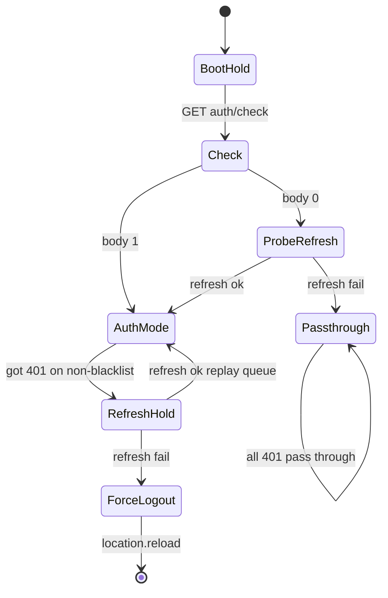

# HTTP-менеджер: очередь, refresh, multi-tab

## Решения (зафиксированы)

- Один менеджер на **все** запросы к базовому API.
- **Auth-режим**: при 401 запросы остаются в очереди; идёт refresh; новые **не уходят в сеть**, копятся; in-flight не отменяем.
- После ответа: **200 / 5xx** — промис завершается, элемент **уходит** из очереди (не переигрывается). **401** — остаётся на replay после refresh.
- Успешный refresh → прогон **остатка** очереди (в т.ч. бывшие 401) заново.
- Провал refresh = **force logout**: reject остатка очереди, затем **`window.location.reload()`** (как при обычном logout в `useSession`). Reload сам сбрасывает менеджер; отдельный долгий passthrough после fail на этой вкладке не обязателен (после reload `check` вернёт `0`).
- Concurrency-лимит **только для GET**; остальные методы без лимита параллелизма.
- Blacklist URL (login / logout / refresh / check) — без hold/refresh-петли.
- Старт: `GET /api/auth/check` → `0|1`; при `0` — один пробный `POST /auth/refresh` (blacklist): успех → **auth**, провал → **passthrough**. Так восстанавливаем сессию при протухшем access и живом refresh (refresh cookie на `/auth/check` не приходит).
- Multi-tab: **Web Locks + BroadcastChannel + короткий localStorage-маркер** (см. ниже).
- До завершения boot (check ± пробный refresh) запросы только копятся (**boot-hold**), в сеть не уходят.
- Refresh-волну начинаем по **первому** 401, не дожидаясь всех in-flight.
- Не-401 ошибки (403/404/4xx/сеть) → сразу `reject`, элемент вне очереди.
- Файлы: `httpManager.ts` + тонкий фасад `apiClient` (без отдельной «опции или»).

## Зачем не «просто axios interceptor»

Нужна явная **очередь задач** с паузой отправки, а не только retry упавших промисов: во время refresh сеть для новых закрыта, 401-элементы живут в очереди до replay.

## Режимы

- **boot-hold**: очередь копится, сеть закрыта, пока не выбран режим.
- **passthrough**: запросы сразу в сеть (GET с concurrency); 401 наружу; refresh не трогаем. После boot, если check=0 и пробный refresh не удался (аноним или сессия мертва).
- **auth**: очередь + hold/refresh/replay. После check=1 или успешного пробного refresh.
- **refresh-hold**: по первому 401; новые не в сеть; in-flight долетают; multi-tab refresh; replay или force logout.
- **force logout**: reject очереди → broadcast → `location.reload()`.

## Очередь (семантика)

Каждый вызов менеджера = элемент `{ config, resolve, reject }` в очереди.

1. В auth без hold: планировщик шлёт с учётом GET-concurrency.
2. Ответ **200** → `resolve`, элемент вне очереди.
3. Ответ **не-401** (4xx/5xx/сеть) → `reject`, вне очереди.
4. Ответ **401** (не blacklist) → элемент **остаётся**, вход в refresh-hold по **первому** такому 401 (если ещё не там); refresh не откладываем до конца всех in-flight.
5. В refresh-hold / boot-hold: новые элементы только enqueue; in-flight (если были) долетают и классифицируются по п.2–4.
6. Refresh OK → оставшиеся элементы снова в планировщик (replay). После успешного refresh каждый оставшийся элемент получает **ровно одну** новую попытку; если снова 401 → `reject` этого элемента **без** нового refresh (волна закрыта). Если позже 401 на другом запросе — новая волна refresh допустима (режим всё ещё auth).
7. Refresh fail → `reject` всем оставшимся, broadcast `refresh-fail`, затем **force logout** = `window.location.reload()` (без обязательного POST `/auth/logout`). Другие вкладки по каналу тоже делают reload.

Blacklist (`/auth/login`, `/auth/logout`, `/auth/refresh`, `/auth/check`): всегда «как passthrough» относительно hold (401 сразу наружу), чтобы не зациклить refresh.

## Multi-tab (предложение простым языком)

**Проблема.** Refresh у вас ротирует refresh-token в Redis: второй параллельный refresh со старой cookie получит 401 и может «разлогинить» другую вкладку. Две вкладки = два менеджера — нельзя оба дергать `/auth/refresh` одновременно.

**Web Locks (замок браузера).** Именованный замок, например `afn-auth-refresh`. Пока вкладка A держит замок, B не входит в критическую секцию — как один ключ от комнаты. Это **mutex**: взаимное исключение «в один момент refresh делает только одна вкладка».

**Почему одного замка мало.** Когда A закончила и отдала ключ, B может войти и сделать refresh **ещё раз** — уже с новым токеном A это снова сломает ротацию. Поэтому после захвата замка: если другая вкладка **только что** обновила сессию — повторный HTTP refresh не делать.

**BroadcastChannel (рация между вкладками).** Канал с именем вроде `afn-auth` на одном origin. Вкладка-лидер после refresh кричит `{ type: 'refresh-ok' }` или `{ type: 'refresh-fail' }`. Остальные:

- на `refresh-ok` → выходят из hold и делают replay своей очереди;
- на `refresh-fail` → force logout = `window.location.reload()` (как лидер).

**localStorage-маркер** (страховка): лидер пишет `afn-auth-refreshed-at = Date.now()`. Вкладка, получившая замок чуть позже, видит «свежий» маркер (например &lt; 5 с) → skip HTTP refresh, только release замка и replay.

Итоговый алгоритм вкладки в hold:

1. Слушать BroadcastChannel.
2. `navigator.locks.request('afn-auth-refresh', async () => { if (!freshMarker) await POST /auth/refresh; set marker; postMessage result })`.
3. Если сообщение уже пришло, пока ждали замок — не дублировать работу; опираться на результат из канала/маркера.

**Кто лидер.** Отдельных выборов нет. Лидер волны = вкладка, которая **первой получила** Web Lock `afn-auth-refresh` (обычно та, чей 401 обработали чуть раньше). Остальные либо ждут тот же lock, либо уже слышат `refresh-ok` / `refresh-fail` по каналу и HTTP refresh не делают. Это не «назначенный лидер навсегда», а лидер **конкретной волны** refresh; на следующей волне снова кто первый взял ключ.

**Если лидера закрыли / убили до ответа refresh.** Web Lock при закрытии документа **освобождается сам**. Следующая вкладка получает замок и продолжает.

Волевое решение по безопасности: **grace / повторная выдача той же пары токенов не делаем.** Если сервер уже ротировал сессию, а `Set-Cookie` не дошёл до браузера (лидера убили mid-flight) — сессия считается потерянной: следующий refresh → 401 → force logout + reload. Не даём окно ~30 с, в котором старый refresh снова обменивается на живые токены (риск при утечке refresh cookie / XSS / перехвате).

Обычные случаи без потери ответа по-прежнему закрыты Web Locks + BroadcastChannel + localStorage-маркером (нет параллельной двойной ротации с двух живых вкладок).

Поддержка multi-tab на фронте: современные Chromium/Firefox/Safari; fallback без Locks — не делаем.

## Backend

Новый метод в [`auth.controller.ts`](apps/backend/src/auth/auth.controller.ts):

- `GET /auth/check`
- Без обязательной авторизации (как `AuthGuard({ strict: false })` или ручная проверка session из middleware).
- Тело: `0` | `1` (number), по наличию валидной access-сессии.
- Cookie `access_token` Path=`/api` — подходит.
- Не требует refresh cookie.

Тип ответа для фронта: `Awaited<ReturnType<AuthController['check']>>` inline, без промежуточных alias.

## Frontend: раскладка файлов

- `services/api/httpManager.ts` — очередь, boot-hold, режимы, планировщик, refresh-hold, multi-tab.
- `services/api/concurrency.ts` — лимитер только для GET.
- `services/api/config.ts` — `concurrency`, `baseURL`, blacklist paths, имена lock/channel/marker.
- `services/api/apiClient.ts` — фасад axios API (`get`/`post`/…) → менеджер; `withCredentials: true`.
- Удалить `authClient`, убрать `p-limit`.
- `authApi`: login/logout/refresh/check/me через `apiClient`; blacklist на login/logout/refresh/check.
- Старт: менеджер сам (или тонкий `initHttpManager`) делает check → при 0 пробный refresh → setMode; параллельно/после при auth — `me()` в sessionStore (bootstrap). Запросы UI, пришедшие раньше конца boot, ждут в очереди.
- Refresh-fail: менеджер сам `location.reload()` + broadcast; без импорта `sessionStore`.

Разрыв цикла: менеджер не импортирует `sessionStore`.

## Критерии приёмки

- Все API-вызовы через менеджер.
- GET ограничены concurrency; не-GET — нет.
- 401 в auth → hold; новые не в сеть; 200/5xx уходят; 401 остаются; refresh ok → replay остатка.
- Blacklist не триггерит hold.
- Refresh fail → reject очереди + reload (force logout); другие вкладки по каналу тоже reload.
- Две вкладки: один успешный refresh на волну (нет двойной ротации).
- Старт: check; при 0 — пробный refresh; boot-hold до выбора режима; login/logout/refresh-fail reload сбрасывают менеджер.

## Правила / заметки (после кода — approve rules отдельно)

- [`.dev/http-client-manager.md`](.dev/http-client-manager.md) — ТЗ уже синхронизировано с обсуждением (до кода).
- Предложить правки [`frontend.mdc`](.cursor/rules/frontend.mdc) и при необходимости `backend.mdc` (`/auth/check`) — только после реализации и явного approve.

## Вне скоупа

- e2e на multi-tab.
- Fallback multi-tab без Web Locks.
- Refresh grace / reuse той же пары токенов (осознанно отвергнуто: безопаснее потерять сессию при mid-flight закрытии лидера).
- Theft detection семейства refresh.
