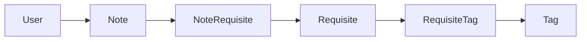

# Notes / tags / requisites — вертикальный срез

## Зафиксированные решения

- Реквизит принадлежит заметке через [`NoteRequisite`](apps/prisma/schema/note.prisma); без note сейчас не создаём (join оставляем под будущие сущности).
- `Tag` — справочник; выбранные теги — новая модель `RequisiteTag`.
- `Requisite.name` — подпись в форме; `payload`: `title`/`text` → `{ value, description? }`, `tags` → `{ description? }`.
- Число реквизитов любого типа не ограничено; в API пока только типы `title` | `text` | `tags`.
- Только свои заметки; `Note.userId` **обязательный**.
- Отдельный CRUD notes и requisites; теги на `type: tags` — подресурс.
- UI: `/notes` (карточки) → `/notes/$id` (документ: просмотр + редактирование отдельными формами).
- `Action` не трогаем.

## 1. Prisma

Файлы: [`apps/prisma/schema/note.prisma`](apps/prisma/schema/note.prisma), [`requisite.prisma`](apps/prisma/schema/requisite.prisma), [`tag.prisma`](apps/prisma/schema/tag.prisma), [`schema.prisma`](apps/prisma/schema/schema.prisma).

- `Note.userId` → `String` (required) + relation без `?`.
- Добавить `RequisiteTag` (`requisiteId` + `tagId`, `@@id`, timestamps/`deletedAt` как у соседних моделей); связать с `Requisite` и `Tag`.
- Подключить `prisma-json-types-generator` (Prisma 7 → пакет `@5+` в `apps/prisma`; при peerDep на TS 6 — проверить generate на текущем TS 5.7, при необходимости зафиксировать совместимый релиз).
- Типы в `apps/prisma/types/` (например `prisma-json.ts`) в namespace `PrismaJson`; на `Requisite.payload` — `/// [RequisitePayload]` (union под title/text/tags). `Action.payload` не типизируем жёстко.
- Миграция через `./scripts/prisma-migration notes_requisites_tags`.

## 2. Backend (Nest, scaffold на host)

Модули: `notes`, `tags` (CLI: `npx nest g module|controller|provider … --no-spec`). Zod DTO рядом с контроллерами. Везде `AuthGuard` + проверка владельца note.

**Notes** — `/notes`

- `GET /` — свои, `deletedAt: null`, с реквизитами (+ теги для `type: tags`).
- `POST /` — пустая note с `userId` из сессии.
- `GET /:id` — своя, полный набор реквизитов.
- `DELETE /:id` — soft delete (`deletedAt`).

**Requisites** — `/notes/:noteId/requisites`

- `GET /`, `POST /`, `GET /:requisiteId`, `PATCH /:requisiteId`, `DELETE /:requisiteId` (soft).
- Create: `Requisite` + `NoteRequisite` в транзакции; validate payload по `type`.
- Доступ только если note принадлежит текущему user.

**Requisite tags** — `/notes/:noteId/requisites/:requisiteId/tags`

- Только если `type === tags`; иначе 400.
- `POST` — добавить связь(и) `RequisiteTag` (body: `tagId` или `tagIds`).
- `DELETE /:tagId` — убрать связь.
- `GET` — список тегов реквизита (удобно для UI).

**Tags** — `/tags` — CRUD справочника (глобальный, без `userId`; любой авторизованный). Soft delete.

Явные return types на методах контроллеров — для `Awaited<ReturnType<...>>` на фронте.

## 3. Frontend

- API: [`apps/frontend/src/api/`](apps/frontend/src/api/) по образцу `usersApi.ts` + `apiClient`; типы ответов inline с `__backend` controllers, body DTO — `import type` из backend dto.
- Маршруты (dir + lazy): `routes/~notes/~index.*`, `routes/~notes/~$noteId/~index.*`; опционально простой `~tags` для справочника (нужен, чтобы тестировать `RequisiteTag`).
- `/notes`: карточки — только `requisite.public === true`, read-only; кнопка создать note → переход в документ.
- `/notes/$noteId`: **view-форма** (все реквизиты) и **edit-форма** (отдельный UI); в edit — CRUD реквизитов через API, для `tags` — подресурс + выбор из `/tags`.
- Обёртка `AuthGuard`; ссылки Notes/Tags в [`~__root.tsx`](apps/frontend/src/routes/~__root.tsx).
- UI на существующем Tailwind/DaisyUI, без новой дизайн-системы.

## 4. Вне скоупа

- Actions / логирование.
- Типы реквизитов `label` | `bool` | `number`.
- Шаринг заметок, hard delete, seed notes (достаточно ручного теста после login).
